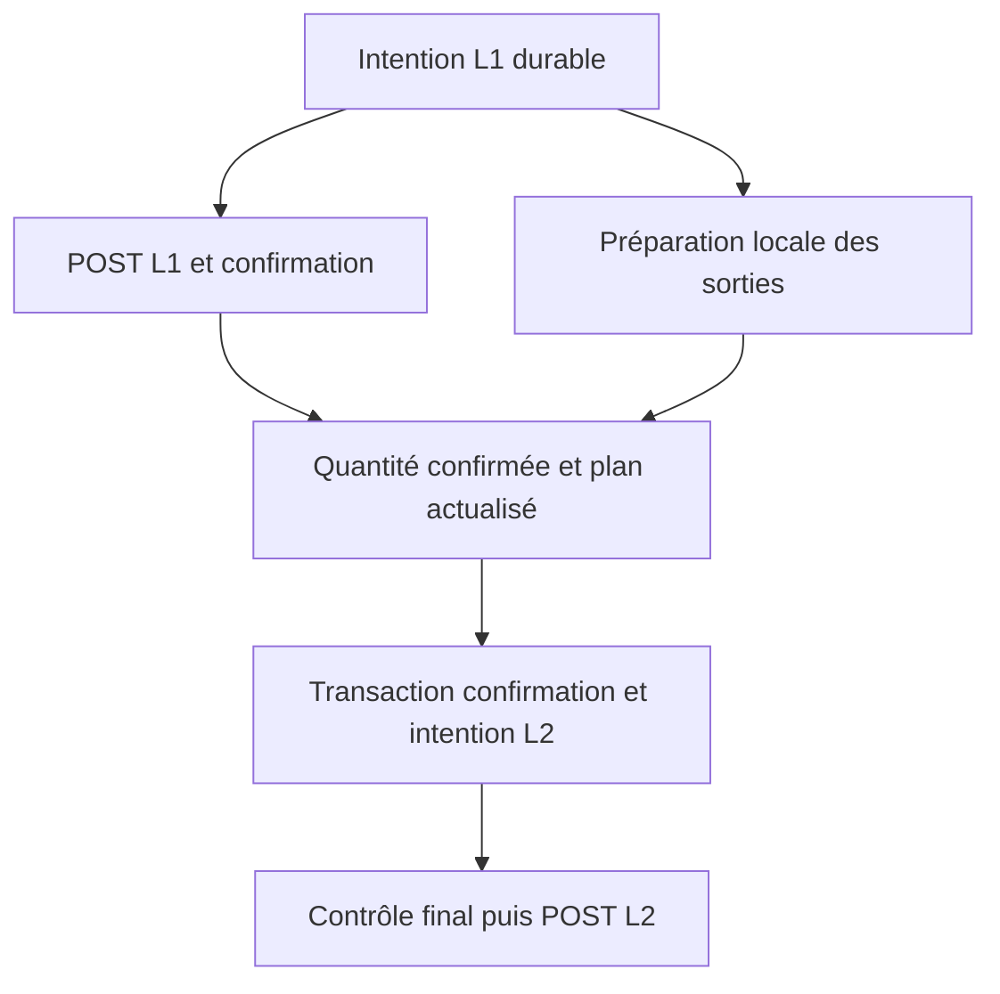

# V3 — analyse des jambes, validations et latences

14 septembre 2026 — complément au REX global. Base examinée : copie locale V2.4.14 et diagnostic réel CTO V2.4.10. Livrable : analyse du code, reconstitution temporelle et laboratoire hors LIVE. Aucun ordre envoyé, aucun réarmement, aucune modification du bot déployé.

## 1. Verdict

**Il est possible d’alléger sensiblement le processus local, mais le principal délai observé sur CTO reste l’attente de confirmation de l’achat.** Il faut optimiser le temps entre une information exploitable et l’envoi suivant, sans vendre une quantité que l’on ne sait pas avoir acquise.

Les améliorations les plus utiles sont :

1. Regrouper les écritures critiques entre les jambes, avec un seul engagement durable de la confirmation L1 et de l’intention L2.
2. Préparer les éléments indépendants de L2 pendant l’attente de L1, puis ajuster à la quantité réellement acquise.
3. Réutiliser des calculs sur des données identifiées, tout en revérifiant le temps écoulé, les générations de flux et les limites au dernier moment.
4. Comparer les sorties possibles après achat, au lieu d’appliquer mécaniquement le seuil de rentabilité d’une nouvelle entrée à une exposition déjà ouverte.
5. Séparer les mesures de file, contrôle, appel HTTP, décodage et décision : une partie des métriques actuelles mélange ces durées.

Le laboratoire livré implémente des primitives pour les points 1, 3, 4 et 5. **Ce n’est pas l’exécuteur V3 complet et ce n’est pas un correctif à installer sur le scanner actuel.** La préparation parallèle, le collecteur de frais privés et l’intégration complète restent à développer et qualifier.

## 2. Ce que signifie « valider un trade »

Quatre validations distinctes sont nécessaires. Les confondre a conduit à surestimer la portée des tests.

| Validation | Question résolue | Ce qu’elle ne résout pas |
|---|---|---|
| Compatibilité API | Cette forme d’ordre et ce marché sont-ils acceptés par l’API ? | Disponibilité future des contreparties et remplissage |
| Décision économique | Ces carnets, frais, arrondis et soldes justifient-ils la taille ? | Persistance du prix pendant l’aller-retour réseau |
| Contrôle juste avant envoi | L’intention préparée reste-t-elle admissible maintenant ? | Atomicité entre contrôle local et appariement distant |
| Confirmation / rapprochement | L’ordre a-t-il réellement été exécuté, pour quelle quantité et quels frais ? | Réussite d’une seconde jambe encore non envoyée |

La documentation MEXC précise que `/api/v3/order/test` valide une requête sans la transmettre au moteur d’appariement. Une prévalidation ne garantit donc pas une sortie MARKET ultérieure. [Documentation MEXC — Test New Order](https://mexcdevelop.github.io/apidocs/spot_v3_en/#test-new-order).

Dans la base auditée, les capacités sont réutilisées sur une durée configurée, au lieu de relancer trois tests API sur chaque signal. C’est déjà une optimisation. La V3 doit conserver cette mise en cache, mais l’invalider sur changement pertinent de marché, de règles, de politique ou de permissions. La durée historique de 72 h ne constitue pas à elle seule une garantie de validité.

## 3. Chemin actuel, étape par étape

### 3.1 Avant la première jambe

`process_live_candidate()` :

1. Vérifie l’âge du candidat et l’armement.
2. Vérifie les limites de perte et la santé des flux.
3. Recalcule le signal avec `_fresh_live_signal()`.
4. Calcule la qualité à la taille réellement finançable avec `live_sized_quality()`.
5. Vérifie la marge temporelle disponible pour la sortie avec `_entry_exit_headroom()`.
6. Vérifie la capacité API, les soldes en cache et les actifs protégés.
7. Transmet les observations BOT Shadow à une file et prépare l’exécution réelle.

`_live_real_attempt()` :

8. Construit l’ordre L1 avec les règles du marché et un parcours de profondeur.
9. Exécute `_entry_price_guard()` : âge du signal, armement, santé, marge temporelle et prix de sortie prudent.
10. Écrit durablement la tentative, l’intention L1 et une observation de carnet.
11. Recontrôle santé et âge après cette écriture.
12. Acquiert le verrou HTTP et réexécute le contrôle final avant l’appel réseau.

Ces répétitions ne sont pas toutes inutiles : du temps passe et les carnets peuvent changer entre elles. Le problème est que le code mélange la répétition nécessaire des **conditions dynamiques** avec la répétition de **calculs numériques et lectures** qui pourraient être partagés.

### 3.2 Envoi et confirmation de L1

`_submit_live_order()` :

1. Enregistre un observateur de l’ordre privé avant l’envoi.
2. Envoie le POST avec un identifiant client durable.
3. Attend le retour de l’appel HTTP synchrone.
4. Journalise la réponse POST avec un commit.
5. Attend le premier résultat terminal jugé fiable, issu du POST, de REST ou du WS privé selon le mode.
6. Journalise le résultat terminal avec un autre commit.
7. Retourne les quantités remplies et la connaissance disponible des frais.

En mode hybride, le WS peut gagner contre REST. Une réconciliation REST continue ensuite. Mais **le chemin appelant attend encore le retour HTTP du POST avant de consommer ce résultat**. Si le WS terminal arrive avant le retour HTTP, son avance peut être partiellement perdue.

L’attente `Event.wait(...50 ms...)` ne signifie pas une pause incompressible de 50 ms : l’événement peut réveiller immédiatement le thread. Réduire cette valeur n’est donc pas une optimisation prioritaire. Le polling REST à 100 ms est un autre mécanisme ; il ne doit pas être confondu avec le réveil WS.

### 3.3 Entre L1 et L2

Le bot calcule la quantité disponible à partir de L1, avec une réserve conservatrice si les frais sont inconnus. Il effectue alors :

- Un parcours du carnet L2 pour vérifier fraîcheur, quantité et rendement.
- Le contrôle du timestamp MEXC et de son décalage par rapport à l’événement L1.
- Une comparaison du résultat au coût de L1, avec un seuil de +0,15 % dans la configuration auditée.
- La construction de `spec2`, qui refait un parcours de profondeur via `live_order_candidates()`.
- Un commit qui prépare l’intention L2 et met à jour la tentative.
- Un dernier `_leg2_post_guard()` avant POST.

Le deuxième parcours peut lire une version de carnet différente du premier. Le contrôle final de prix limite empêche certains ordres devenus insuffisamment profitables, mais l’ensemble reste plus difficile à expliquer et à mesurer qu’une décision fondée sur un instantané clairement identifié.

### 3.4 Secours et clôture

Si L2 est impossible ou laisse un résidu significatif, le bot prépare un MARKET de retour sur la première paire. Le premier secours n’exige pas un carnet local frais : l’exposition existe déjà, et une télémétrie locale périmée ne doit pas être interprétée comme une absence certaine de marché distant.

Une seconde sortie est bornée et exige une confirmation REST cohérente du précédent ordre, la vérification du solde propre au trade et une quantité ajustée aux remplissages. Si le statut d’un ordre reste incertain, la chaîne de ventes est arrêtée pour éviter une double vente. Les frais exacts et la comptabilité sont ensuite rapprochés ; une exposition restante doit rester explicite.

Il ne faut pas supprimer ces contrôles pour gagner un aller-retour : le risque serait de transformer une lenteur en vente d’un ancien bag ou en quantité vendue deux fois.

## 4. Ce que les latences réelles permettent d’affirmer

### 4.1 Chronologie CTO, en millisecondes depuis T0

Source : `diagnostic_trade_20260914_125415_877143.json.gz` et export détaillé de l’incident fourni dans la conversation. T0 = `1789358303934`.

| Événement | T0 + | Lecture |
|---|---:|---|
| Décision | 0 ms | Signal initial |
| Création de la tentative | 7 ms | Début de préparation enregistré |
| Début d’appel L1 enregistré | 20 ms | Inclut le contrôle final dans la définition actuelle |
| Retour HTTP L1 | 74 ms | Durée monotone HTTP enregistrée : 53,349 ms |
| Réception de la confirmation WS L1 | 89 ms | `leg1_confirm_ms = 69` depuis le début d’appel |
| Préparation du secours | 94 ms | L2 a été refusée localement |
| Début d’appel secours | 98 ms | Environ 9 ms après la réception WS L1 |
| Retour HTTP secours | 138 ms | Durée enregistrée : 39,653 ms |
| Réception WS du secours | 150 ms | Statut CANCELED, quantité exécutée nulle |
| Fin de traitement de la tentative | 200 ms | Ne signifie pas fin de l’exposition CTO |

Les timestamps muraux sont arrondis à la milliseconde ; les mesures monotones peuvent différer de leur soustraction d’environ une milliseconde. Les deux conventions doivent rester distinctes.

**Il ne faut pas additionner 53,349 ms HTTP et 69 ms de confirmation.** Les deux commencent au même point. Sur cet achat, la confirmation est reçue environ 15 ms après la réponse HTTP. La durée décision→confirmation est 89 ms.

Le journal initial a mesuré **13,012 ms** de préparation. C’est une cible locale sérieuse, mais ce champ comprend le travail de préparation/journalisation, pas exclusivement un fsync disque. La durée mesurée du commit de réponse POST est **2,331 ms**. La durée propre du commit terminal n’est pas isolée dans cet export.

Sur un autre ordre conservé, le secours 牛来, le WS arrive à 74 ms depuis POST, alors que le retour HTTP est mesuré à environ 76,254 ms. Cela confirme que l’ordre des arrivées peut s’inverser. L’avance observée ici est de quelques millisecondes, pas une preuve d’un gain de dizaines de millisecondes.

### 4.2 Ce qui a provoqué le refus CTO

Au contrôle L2, le carnet était âgé localement de 105 ms, contre un plafond de 100 ms. Son âge MEXC enregistré était de 122 ms. La seconde jambe n’a pas été envoyée. Réduire le délai local de quelques millisecondes aurait pu changer ce refus précis, **mais ne prouve pas que la vente aurait été remplie ni rentable**.

L’annulation du secours est un événement distinct. Sa cause exchange reste inconnue. Optimiser la préparation ne suffit pas à démontrer sa disparition.

### 4.3 Les profils de simulation sont trop optimistes pour cet épisode

Les échéances FAST 15/30 ms et TARGET 25/50 ms sont cumulées depuis T0. Sur CTO, la confirmation L1 seule arrive à T0+89 ms. Le profil DEGRADED 50/100 laisse seulement 11 ms après cette confirmation pour atteindre son échéance L2, avant même de considérer une confirmation de la vente.

Ces profils peuvent rester des expériences de sensibilité. Ils ne représentent pas la distribution réelle observée de ce serveur et de cette exécution. La V3 doit simuler séparément le départ L1, le remplissage, sa notification, le départ L2 et sa notification.

## 5. Défauts de mesure et validation à améliorer

### A. Le champ HTTP contient du calcul local

Dans `MexcPrivateClient._request()`, les compteurs de début sont pris **avant** `on_start()`. Or `on_start()` réalise le contrôle final de santé et de prix. Le champ `http_ms` comprend donc ce contrôle, puis l’appel de transport.

J’ai exécuté cette méthode isolée par AST avec une horloge et un transport factices : file 2 ms, contrôle 7 ms, transport 53 ms. Le code actuel annonce 60 ms « HTTP ». Le prototype distingue correctement 2 / 7 / 53 ms. Cela valide une séparation de mesure, **pas un gain de vitesse**.

La cible doit mesurer : attente du canal ; contrôle final ; signature ; appel du transport ; décodage de la réponse ; traitement du résultat ; commit. Même « durée du transport » reste la durée d’un appel logiciel, pas une mesure des seuls paquets réseau.

Le timestamp signé est actuellement construit avant l’acquisition du verrou HTTP. En V3, préparer les champs stables en amont, puis calculer timestamp et signature au plus près de l’envoi, après acquisition du canal. Une longue attente ne doit pas consommer inutilement la fenêtre de réception de la signature.

### B. Le budget de confirmation a un effet plus strict que le seuil affiché

La règle actuelle est :

`budget = max(75 ms, p95 des dernières confirmations L1) + 10 ms`.

Sans p95 supérieur à 75 ms, le budget est donc 85 ms. Avec un plafond local L2 de 100 ms, le carnet de sortie ne doit pas avoir plus de **15 ms** au contrôle de marge, même si le seuil d’entrée affiché est 50 ms. Si le p95 atteint 90 ms, le budget devient 100 ms et pratiquement aucune ancienneté locale n’est tolérée.

Cette prudence vise l’absence de nouvelle mise à jour pendant L1. Elle ne prévoit pas si le carnet se rafraîchira, et sa marge finale fixe de 10 ms n’est pas une mesure de la queue complète de traitement. L’historique des confirmations est déjà restauré depuis la base au démarrage ; ce point n’est pas à réimplémenter.

Proposition : rendre le budget visible et mesurer les quantiles du chemin complet, avec taille de l’échantillon et ancienneté. Séparer les marchés très actifs et les marchés rarement mis à jour. Ne pas abaisser le plancher sur quelques bons trades ; conserver le contrôle réel après achat.

### C. Des contrôles répétés peuvent porter sur des données différentes

Le chemin nominal peut appeler la santé de route au gateway, dans le premier contrôle de prix, après journalisation et dans le contrôle pré-POST. La marge temporelle peut être évaluée trois fois. Plusieurs copies de `state['bbo']` et plusieurs acquisitions de verrous interviennent.

La V3 doit séparer :

- Les éléments stables : règles, orientations, modèles de frais, forme d’ordre, précision, capacités.
- Le calcul par instantané : profondeur à la taille, stress, prix limite, rendement prudent.
- Les éléments toujours dynamiques : temps écoulé, STOP/circuit, quotas, quantité possédée, version/génération, flux en rattrapage.

On peut réutiliser le deuxième groupe si toutes ses dépendances sont inchangées. On ne peut jamais réutiliser aveuglément le troisième.

### D. Le résultat terminal doit devenir une preuve complète

Le validateur actuel vérifie notamment statut terminal, identifiant client, symbole, nombres finis et quantité maximale. La V3 devra également formaliser le rattachement à l’ordre attendu, le sens, la génération de tentative, la cohérence des cumuls et la déduplication. La notification d’un seul remplissage partiel ne suffit pas à vendre une quantité supposée totale.

Cette amélioration devient indispensable si l’on veut avancer sur WS alors que la réponse POST est encore en vol. Elle ne doit pas être remplacée par la seule réception de n’importe quel message privé.

## 6. Optimisations proposées, par priorité

### P0 — Une seule transaction entre confirmation L1 et préparation L2

Chemin nominal actuel après retour HTTP L1 :

| Barrière actuelle | Contenu |
|---|---|
| Commit 1 | Réponse POST / état submitted |
| Commit 2 | Résultat terminal L1 et quantités |
| Commit 3 | État de tentative et intention d’ordre L2 |

Cible : conserver la preuve POST, la confirmation validée L1 et l’intention L2 dans **une transaction FULL** avant tout POST L2. L’intention L1 reste durable avant son propre POST. Un redémarrage entre les deux rapproche L1 par son identifiant, puis examine si une intention L2 existe ; il ne soumet rien aveuglément.

Si aucun plan L2 n’est admissible, enregistrer durablement le remplissage et l’exposition ou l’intention de secours. La fusion ne doit pas attendre indéfiniment une sortie intéressante. Si la transaction échoue, aucun prochain ordre n’est autorisé par cette opération ; le contrôleur conserve la responsabilité de réconciliation.

Le prototype `confirm_and_prepare()` démontre la transaction groupée, les preuves séparées, le rollback sur conflit et le refus d’une seconde transition identique. Il ne réalise ni validation exchange ni soumission d’ordre.

**Gain structurel : deux barrières de commit en moins dans ce passage.** Gain temporel serveur non encore mesuré. Il serait faux de soustraire automatiquement deux fois 13 ms : les 13 ms CTO concernent la préparation initiale, pas chacun de ces commits.

### P0 — Sortir les observations lourdes du journal minimal

Les préparations actuelles incluent `_observation_sql()`, qui copie des niveaux sous verrou, sérialise un document JSON puis le joint au commit critique. Le contenu utile à la reprise doit être petit : ordre, quantité, prix, identités des données utilisées, inventaire et décision.

Les captures détaillées peuvent aller dans une file dédiée et bornée. Mais il faut préserver la traçabilité : événement minimal durable, identifiant de capture, compteur de perte de télémétrie. Une capture perdue ne doit pas se transformer en preuve inventée après coup. En cas de défaillance du journal critique, bloquer les nouvelles entrées ; ne pas continuer simplement parce que les métriques sont asynchrones.

Le journal réel est déjà isolé de la recherche et utilise une connexion persistante WAL/FULL. Passer en mémoire ou supprimer la durabilité n’est pas l’amélioration proposée. Le checkpoint WAL et les attentes de verrou doivent être mesurés séparément.

### P1 — Préparer L2 pendant l’attente de L1

Pendant que le POST L1 et sa confirmation attendent le réseau, préparer : règles de vente, identifiant réservé, alternatives de sortie autorisées, structure d’ordre, carnet et estimation à une quantité indicative.

Après confirmation, remplacer la quantité indicative par la quantité acquise disponible, frais compris ou réserve explicitement bornée. Recontrôler prix et fraîcheur. Puis engager durablement l’intention avant son envoi.

Seul le travail indépendant peut être masqué. Une vente L2 envoyée avant acquisition confirmée changerait la stratégie et pourrait consommer des actifs préexistants. Ce n’est pas proposé.

Exemple purement illustratif : 69 ms de confirmation et 3 ms de préparation deviennent 69 ms au lieu de 72 ms si toute cette préparation peut être faite à temps en parallèle. Ni les 3 ms ni le gain ne sont une mesure actuelle du serveur. Une invalidation de carnet impose du recalcul.

### P1 — Un instantané cohérent et un calcul partagé

Pour chaque route, capturer les deux carnets nécessaires, les marks des stablecoins, les règles, la révision de compte/réservation et la révision de risque. Éviter les copies globales de centaines de BBO pour quelques symboles, tout en incluant les marchés réellement utilisés pour la valorisation.

Le plan contient quantité, prix limite, limites temporelles et identité de ses dépendances. Le prototype `ValidationTicket` montre comment invalider une réutilisation lorsqu’une version, une génération, un solde, une valorisation, une politique ou une capacité change. Même sans changement de version, l’expiration, STOP ou rattrapage interdit la réutilisation.

Il ne faut pas imposer une égalité de version comme condition universelle d’envoi : à 10 ms de mise à jour, cela pourrait faire rejeter presque tout après un commit lent. Si un carnet change, un contrôle léger peut vérifier que l’ordre **déjà figé** reste exécutable et conforme sur le nouveau carnet. S’il faut changer quantité ou prix, l’intention modifiée doit être journalisée avant envoi. Ce contrôleur d’intégration reste à réaliser.

### P1 — Éviter deux parcours L2 et les calculs de qualité redondants

Le parcours L2 utilisé pour décider devrait également fournir le prix et la quantité de l’ordre, avec arrondis vérifiés. Les contrôles temporels et de génération restent après journalisation. On évite ainsi de décider sur un carnet puis construire l’ordre sur un autre sans provenance claire.

Dans `live_sized_quality()`, une recherche peut évaluer la taille haute, la taille basse puis six points intermédiaires. Chaque évaluation calcule plusieurs stress ; `_quality_coverage3()` reparcourt aussi la première jambe normale déjà calculée. Réutiliser ce résultat est une optimisation locale identifiable. Des sommes cumulées sur les niveaux peuvent ensuite accélérer l’évaluation des tailles, à condition d’invalider le cache à chaque modification et de vérifier les arrondis.

Le coût `compute_us` de la qualité CTO était de l’ordre de 157 µs dans l’observation historique : cela n’explique pas à lui seul les 69 ms de confirmation. Il faut réduire ce coût pour la charge globale, mais ne pas le présenter comme le remède principal à cet incident.

### P1 — Choisir une sortie, pas rejouer le filtre d’entrée

Avant achat, refuser un rendement insuffisant est cohérent. Après achat, le coût est déjà engagé. Il faut comparer les produits nets prudents des sorties autorisées sur une même quantité.

Exemple de décision, entièrement hypothétique :

| Coût engagé | L2 vers USD1 | Secours vers USDT | Lecture |
|---:|---:|---:|---|
| 20 USDT | 20,01 USDT nets, +0,05 % | 19,80 USDT nets | Refuser L2 uniquement parce qu’elle n’atteint pas +0,15 % choisirait ici une sortie moins favorable |
| 20 USDT | 19,95 USDT nets | 19,80 USDT nets | La petite perte de L2 peut réduire davantage le risque économique que le secours |

Le prototype `select_exit()` compare ces cas et refuse de comparer des quantités différentes, une profondeur incomplète, une donnée périmée, une option interdite ou un ordre antérieur incertain. Il applique un budget de perte estimée explicite.

**Limites :** les produits nets sont des entrées du prototype, pas des remplissages garantis. Les frais, le risque de valorisation du stablecoin, le minimum d’ordre et les formes d’ordre doivent être calculés par le futur moteur. Si aucune sortie n’est admissible, retourner « aucune » signifie transférer le contrôle à la gestion d’exposition, jamais abandonner le stock. L’intégration d’une politique de réduction de perte serait une évolution économique à qualifier séparément.

### P2 — Confirmation WS réellement indépendante du retour POST

La cible serait un coordinateur événementiel qui reçoit POST, WS et REST sur des chemins indépendants, avec un observateur enregistré avant le départ de l’ordre. Une confirmation terminale complète et corrélée peut permettre de préparer l’étape suivante même si la réponse HTTP tarde encore.

Pour envoyer L2 pendant qu’un appel L1 reste en vol, il faut aussi éviter que le verrou ou le pool de connexion unique de soumission bloque cette vente. Cela exige une conception des canaux et des limites de concurrence ; remplacer le POST synchrone par un thread ne suffit pas. La concurrence des **tentatives** peut rester à une seule.

Un retour HTTP contradictoire doit déclencher une réconciliation. Le premier retour n’autorise pas à ignorer les suivants. Les délais réseau, les erreurs de timestamp et les états inconnus restent tracés sans retry aveugle.

Priorité secondaire tant que les traces ne montrent pas une fréquence ou une amplitude importante de WS reçus avant POST. Sur les exemples disponibles, on ne peut pas promettre un gain massif.

### P2 — Frais via remplissages privés, avec repli REST

La documentation MEXC décrit un flux privé de transactions contenant identifiant de trade, identifiant d’ordre, quantité, montant et frais avec leur devise. Il peut alimenter une agrégation des frais sans attendre systématiquement `myTrades`. [Documentation MEXC — Spot Account Deals](https://mexcdevelop.github.io/apidocs/spot_v3_en/#spot-account-deals).

Le code audité exploite les événements d’ordres ; un collecteur des remplissages pourrait améliorer la précision de la quantité vendable et réduire les reliquats de réserve. Il faut dédupliquer les trades, vérifier que leur cumul couvre le total exécuté, traiter les devises de frais et revenir à REST si l’ensemble est incomplet. Un dernier remplissage reçu ne garantit pas à lui seul que tous les événements précédents sont arrivés.

Les requêtes de commissions L1 sont **déjà différées** par défaut. Cette proposition ne peut donc pas être créditée du gain d’un appel REST entier entre L1 et L2 dans le code actuel. Son intérêt supplémentaire concerne la précision et la durée totale de rapprochement.

### P2 — Alléger la file de candidats sans perdre les événements de carnet

Le gateway fait certaines reprises à intervalle fixe de 10 ms, dans une fenêtre courte. Une file de candidats remplaçables par la dernière version, réveillée sur nouvelle donnée pertinente, peut éviter de retraiter une version inchangée et de monopoliser le worker pendant une attente.

Cela concerne les **candidats économiques**, jamais les deltas de carnet qui doivent rester complets et ordonnés. Il faut une politique d’équité entre routes et une date d’origine claire, pour ne pas rendre artificiellement jeune une ancienne opportunité.

## 7. Ce qui ne doit pas être « optimisé » par suppression

- Ne pas augmenter les seuils de fraîcheur pour masquer une attente locale.
- Ne pas envoyer les deux ordres dépendants simultanément sur une quantité espérée.
- Ne pas transformer le secours en boucle MARKET sans confirmation.
- Ne pas considérer un accusé de réception HTTP comme une preuve de remplissage.
- Ne pas supprimer la réserve de frais quand les frais réels sont encore inconnus.
- Ne pas supprimer la preuve durable avant chaque nouvel ordre.
- Ne pas attribuer les délais de transport, de CPU, de disque et d’appariement à une cause unique.
- Ne pas choisir automatiquement IOC ou MARKET sous prétexte de rapidité : les remplissages partiels et le risque de prix changent alors la stratégie.

## 8. Résultats du laboratoire livré

Le laboratoire utilise la bibliothèque standard Python, des fonctions injectées et des bases temporaires. Il ne possède ni identifiants API, ni client MEXC, ni adaptateur réseau.

### Vérifications fonctionnelles

**15 tests réussis** : séparation des durées ; absence d’appel après refus du contrôle ; invalidation d’un ticket sur chaque dépendance ; expiration sans changement de version ; STOP/rattrapage ; meilleure sortie à petite marge ou petite perte ; refus des données invalides ; interdiction d’une sortie sous incertitude ; atomicité des preuves et de l’intention ; rollback ; unicité de transition ; obligation de recontrôler après commit lent.

Ces tests ne couvrent pas un moteur d’ordres complet, une coupure électrique réelle, les comportements MEXC ni la rentabilité. La validation de receipts et le contrôleur de risque sont des responsabilités explicites du futur intégrateur.

### Microbenchmark du journal

200 mesures retenues après 20 échauffements, par variante, sur la même classe de base temporaire SQLite WAL/FULL. Checkpoint automatique désactivé pour isoler ce petit benchmark ; ne pas recopier ce réglage en production sans politique de checkpoint.

| Variante expérimentale | Médiane | p95 |
|---|---:|---:|
| Trois commits | 45,25 µs | 317,07 µs |
| Transaction groupée | 25,25 µs | 56,10 µs |

Le gain local médian est d’environ **20 µs**. Ces temps sont très inférieurs à ceux observés pour certaines préparations sur le serveur. **Ils ne permettent pas de prédire le gain VPS.** L’ordre d’exécution des variantes et les conditions de ce petit test ne constituent pas une campagne statistique complète. Le résultat solide est la réduction du nombre de barrières, avec maintien des deux preuves et de l’intention en une transaction.

### Fichiers

- `execution_core.py` : primitives expérimentales, sans transport réel.
- `test_execution_core.py` : tests unitaires des primitives.
- `audit_and_benchmark.py` : extraction isolée de `_request()` et benchmark temporaire.
- `measurements.json` : résultats obtenus et empreinte du code source audité.
- `README.md` : utilisation et limites du laboratoire.

Empreinte SHA-256 de la copie V2.4.14 auditée : `47f953381159977b4ccf2a09eee3e03eadcbf45e4046a7ae0b0ba42ba9d5a102`.

## 9. Plan d’intégration dans la V3

1. **Instrumentation et référence** : temps monotones par étape, traces séparées POST/WS/REST, capture des dépendances. Mesurer particulièrement confirmation disponible→décision L2→commit→appel L2.
2. **Journal et plan partagé** : transaction groupée, observation détaillée hors chemin critique, même instantané pour prix/quantité/validation. Tester arrêt avant commit, après commit et après envoi sans réponse.
3. **Coordinateur de sortie** : quantité confirmée, frais, comparaison économique et états d’incertitude. Rejouer CTO, SAGA, SKL et 牛来 sans inventer les données manquantes.
4. **Préparation parallèle et confirmation événementielle** : seulement après validation des règles de propriété des états et des preuves. Mesurer le gain restant avant d’ajouter la concurrence réseau.
5. **Qualification serveur sans ordre** : mesurer p50/p95/p99, taille d’échantillon, charge complète et modes dégradés. Comparer les refus et les plans avec la référence, pas seulement la vitesse.

L’objectif local proposé est de ramener confirmation disponible→départ L2 à quelques millisecondes dans le régime normal ; il s’agit d’une cible à dimensionner au stockage et à la charge, pas d’une performance acquise. Aucun objectif de 15/30 ms de bout en bout ne peut être annoncé sur la base des confirmations réelles examinées.

## 10. Sources et limites de l’audit

- Copie locale `v2414_work/app.py` : fonctions de gateway, qualité, santé, construction d’ordre, soumission, confirmation, journal, secours, compte et keepalive relues. Audit ciblé de l’exécution, pas preuve formelle de tout le scanner.
- `diagnostic_trade_20260914_125415_877143.json.gz` : événements et mesures CTO, plus un secours 牛来. Échantillon réel trop petit pour caractériser toute la distribution des délais.
- Export détaillé CTO reproduit dans la conversation : timestamp des préparations et refus L2.
- `REX_GLOBAL_MEXC_V1_V2_CADRAGE_V3_2026-09-14.md` : cadre et invariants conservés.
- Documentation officielle MEXC consultée le 14 septembre 2026 pour la portée de `/order/test` et le contenu du flux privé de transactions. Elle ne donne pas la cause de l’annulation du secours CTO.

Les prototypes sont des améliorations préparées et vérifiées hors LIVE, à intégrer à la conception V3. Aucune latence réseau future, aucun remplissage et aucun gain financier ne sont garantis par ce travail.
